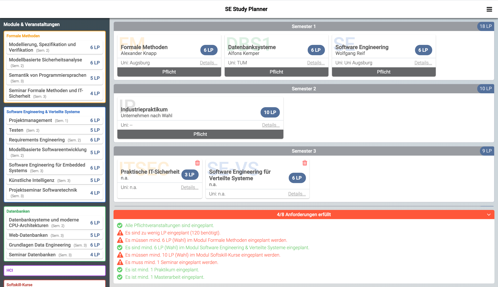

# SE Study Planner

Kleine Web-App, die uns SE-lern die Studienplanung ein wenig erleichtern soll. Im jetzigen Zustand sind die Studiengangsinformationen nur händisch in einem json file konfigurierbar.

> Disclaimer: Das Tool ist nach bestem Wissen und Gewissen erstellt, aber für Korrektheit der Ergebnisse kann nicht garantiert werden! Jegliche Belegungen, die man sich zusammenstellt, müssen im Zweifel mit der Prüfungsordnung und/oder dem Studiengangskoordinator abgesprochen werden!

[Heroku Deployment](https://se-study-planner.herokuapp.com/) (keine Premium App. Start kann also etwas dauern, wenn sie länger als 30 Minuten nicht genutzt wurde)

# Readme Inhalt:

- [Architektur](#Architektur)
- [Roadmap](#Roadmap)
- [Lokales Setup](#Lokales-Setup)
- [Mithelfen](#Mithelfen)

# Architektur

#### Server

Minimaler expressJS Server (Datei `server.js` auf root-level), der die Angular App served und unter der Route `/data` die Studiengangsinfos bereitstellt.

#### Daten

Die Daten sind zur Zeit hardgecoded in einem json File (`data/studiengang_se14.json`).

Ein Studiengang besteht aus einigen Grunddaten (Name, ECTS, Anzahl Semester, ...) sowie Modulen, Veranstaltungstypen und Veranstaltungen (Vorlesungen, Seminare, etc.).

- Veranstaltungen gehören zu einem Modul und sind von einem bestimmten Typ und können Pfichtveranstaltungen sein.
- Module können definieren, wie viele Wahlpflicht Credits mindestens in ihnen geleistet werden müssen.
- Veranstaltungstypen können definieren, wie viele Veranstaltungen des Typs man mindestens gehört werden müssen.

Die (noch nicht vollständigen) Daten für den 14. Jahrgang sind unter `data/studiengang_se14.json` zu finden. Das detaillierte Schema für die Daten ist unter `src/app/datatypes` zu finden.

#### Frontend

Angular frontend, das links alle Veranstaltungen eines Studiengangs nach Modulen geordnet anzeigt und rechts die konkrete Auswahl an Veranstaltungen auf die Semester. Rechts unten lebt eine Komponente, die die Regeln des Studiengangs anzeigt und ob diese durch die gewählten Veranstaltungen alle erfüllt sind (zB mind. 120 LP, mind. 1 Seminar, etc.).

"Behind the scenes" existieren drei Services:

- `StudiengangService`, der hauptsächlich die Daten vom Backend holt und diese der ganzen App zur Verfügung stellt.
- `BelegungService`, der die aktuelle Auswahl an Vorlesungen hält und Methoden sowie Events zum Hinzufügen/Entfernen von Veranstaltungen zur Belegung bereitstellt.
- `RegelCeckerService`, der bei jeder Belegungsänderung alle Regeln des aktuellen Studiengangs überprüft, den aktuellen Regelzustand speichert und Components zur Verfügung stellt.

Besonderheiten / Designentscheidungen:

- Pflichtveranstaltungen werden sofort nach Laden der Daten eines Studiengangs in die Belegung übernommen
- Veranstaltungen werden als 'cards' dargestellt. Dieselbe Komponente wird in 'mini' Ansicht links in der Modulansicht und in normaler Größe rechts in den Semestern verwendet, was natürlich zu etwas "Schizophrenie" im html & css führt.

# Roadmap

- [x] Daten für alle Veranstaltungen anlegen
- [ ] Detailbeschreibungen der Veranstaltungen in Popup anzeigen
- [ ] About Info Popup hinzufügen
- [ ] Drag and Drop
- [x] Export der gewählten Belegung als json/Excel/CSV/...
- [ ] Upload & Import von Studiengangs- und Vorlesungsinformationen als json File(s)
- [ ] "Auto-Belegung", die mit minimal vielen Veranstaltungen alle Regeln erfüllt
- [ ] GUI zum erstellen/editieren von Studiengangsinfos
- [ ] Vorgängerabhängigkeiten zwischen Veranstaltungen integrieren
- [ ] Backend mit Datenbank für Studiengänge
- [ ] Integrieren anderer Studiengänge -> generischeres Tool?

# Lokales Setup

- Repo clonen
- Ins `src` Verzeichnis cd'en
- `ng build --watch` //--watch für automatisches Recompilen des frontends
- Ins root Verzeichnis des Repo springen
- `npm run start` startet den Server
- Die App ist unter `localhost:8080` erreichbar

# Mithelfen

Hilfe ist gerne gesehen :) Falls Du Lust hast eins der Features aus der Roadmap zu implementieren sag mir (Fabian) einfach Bescheid!
